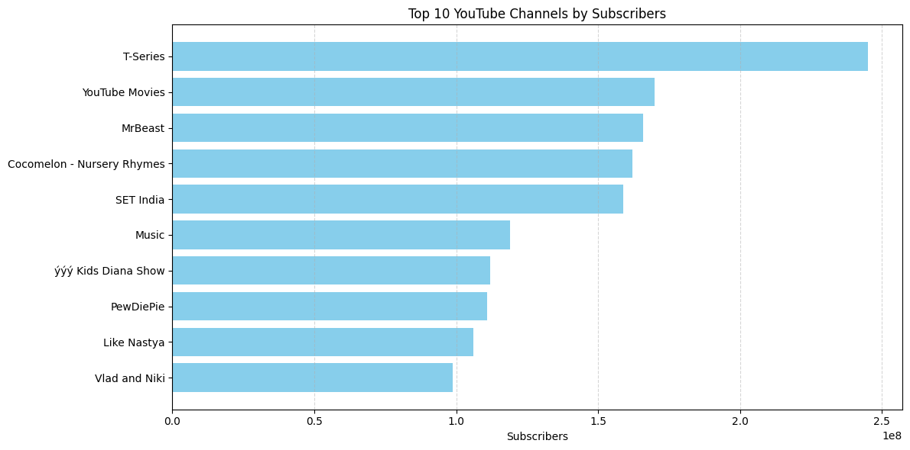
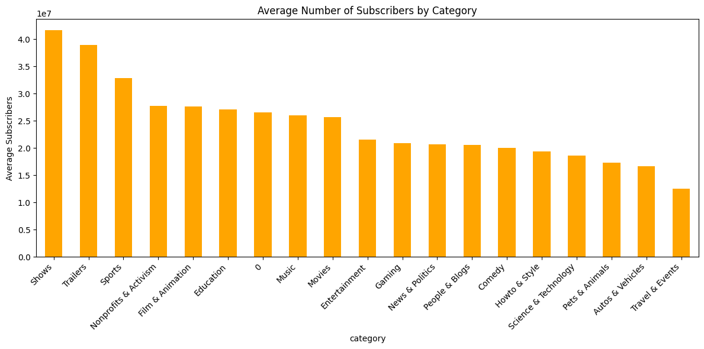
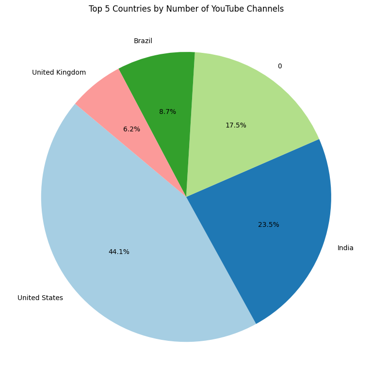
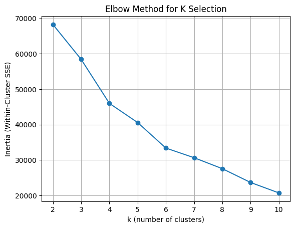
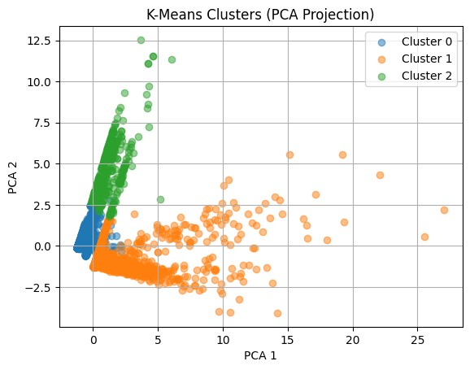

# 📊 End-to-End Social Media Analytics & Machine Learning

🚀 An end-to-end data science project analyzing social media platforms (YouTube + Facebook) to extract insights and apply machine learning for engagement optimization.

---

## 📌 Overview
This project combines **Exploratory Data Analysis (EDA)** and **Machine Learning** to understand content performance, audience behavior, and engagement patterns across social media platforms.

---

## 📂 Datasets
- 📺 YouTube Global Statistics Dataset (1000+ channels, 29 features)
- 📘 Facebook Marketplace Dataset (7000+ records, engagement metrics)

---

## ⚙️ Project Workflow

### 🔹 Data Preprocessing
- Cleaned and handled missing values
- Converted data types (currency, dates, etc.)
- Feature engineering (time-based features, engagement metrics)

### 🔹 Exploratory Data Analysis (EDA)
- Analyzed subscriber growth, views, and categories
- Compared content performance across regions and categories
- Identified engagement trends and patterns

### 🔹 Machine Learning
- Applied **K-Means Clustering** for engagement segmentation
- Used **Elbow Method** to determine optimal clusters
- Applied **PCA (Principal Component Analysis)** for visualization

---

## 📊 Key Visualizations

### 🔝 Top YouTube Channels by Subscribers


### 📊 Category-wise Subscriber Analysis


### 🌍 Country-wise Distribution of Channels


### 🤖 Elbow Method for Optimal Clusters


### 📉 Cluster Visualization using PCA


---

## 📈 Key Insights
- 🎯 Entertainment & Music dominate global engagement
- 📊 Strong positive correlation between subscribers and views
- 🕒 Posting time significantly impacts engagement
- 🤖 Social media content can be grouped into distinct engagement clusters
- 🌍 USA and India lead in content creation due to strong digital ecosystems

---

## 🛠️ Tech Stack
- **Programming:** Python  
- **Libraries:** Pandas, NumPy  
- **Visualization:** Matplotlib, Seaborn  
- **Machine Learning:** Scikit-learn (K-Means, PCA)

---

## 📁 Project Structure
```
social-media-analytics-ml/
│
├── data/
│    ├── Global YouTube Statistics.csv
│   ├── Facebook_Marketplace_data.csv 
├── notebooks/
│   ├── youtube_eda_analysis.ipynb
│   ├── facebook_ml_clustering.ipynb
│
├── images/
│   ├── top_channels.png
│   ├── category_analysis.png
│   ├── country_distribution.png
│   ├── elbow_method.png
│   ├── cluster_visualization.png
│
├── README.md
├── requirements.txt
```

---

## 🔗 Live Demo (Colab)
👉 Add your Colab link here

---

## 👨‍💻 Author
**Neeraj Gupta**  
BTech CSE (AI & Data Science)  
MIT-WPU, Pune  

---

## ⭐ If you found this project useful, consider giving it a star!
